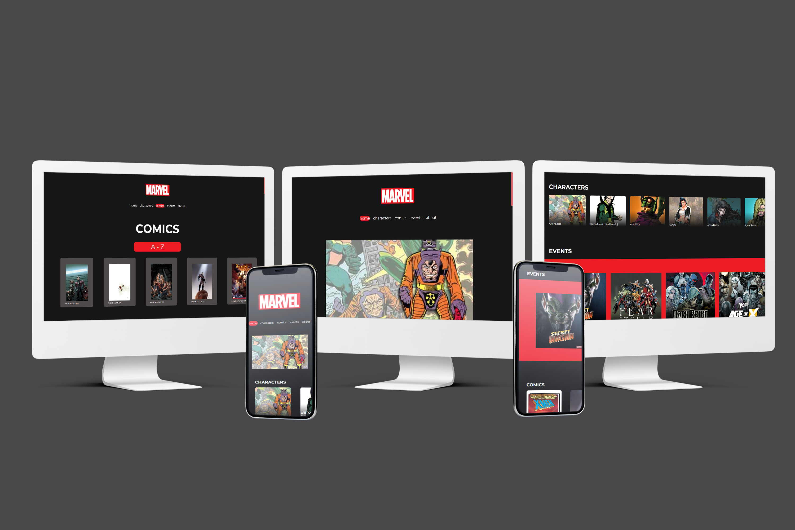

<h1 align="center">
Consuming Marvel API
</h1>

<a href="#-tecnologias">Tecnologias</a>   |   
<a href="#-projeto">Projeto</a>   |   
<a href="#-observações">Observações</a>

 

## Tecnologias

Esse projeto foi desenvolvido com as seguintes tecnologias:

- [React](https://reactjs.org/)
- [JavaScript](https://developer.mozilla.org/pt-BR/docs/Web/JavaScript)

## Projeto

Esse projeto é apenas uma aplicação de conhecimentos adquiridos em meus estudos, com o único intuito de testar meu aprendizado! Eu escolhi a api da marvel pra consumir e deixar visualmente agradável com a ajuda da designer ux [`Ariadna Cavalcante`](https://www.linkedin.com/in/ariadna-cavalcante/).

## Observações

- Para instalar todas as dependências utilizadas no projeto basta rodar o comando `yarn`
- O servidor pode ser iniciado com `yarn start`, onde se tem acesso pelo [`localhost:3000`](http://localhost:3000/) no navegador.
- Nesse projeto foi utilizado variáveis ambientes que estão descritas no .env.example.

---

- Projeto feito apenas para teste de conhecimento 💻💖🚀
- Todos direitos reservados a Marvel.
